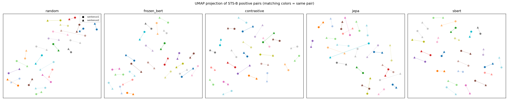

# EmbedLab — From Contrastive Learning to RAG Retrieval

A from-scratch PyTorch implementation of contrastive text representation learning, benchmarked against SBERT, extended with a JEPA-inspired self-supervised objective, and evaluated end-to-end through a RAG retrieval pipeline.

Most people use embeddings as a black box. This project opens the box: we implement contrastive text representation learning from scratch, extend it with a JEPA-inspired self-supervised objective, and measure whether the choice of training signal actually matters for downstream RAG retrieval quality. Spoiler: it does, and the why is interesting.

> **Status:** in progress. Module 1 (contrastive) is trained and evaluated — contrastive fine-tuning closes most of the gap to SBERT. Module 2 (JEPA-inspired) is also trained and evaluated, with a genuinely interesting **negative result**: it collapsed. Module 3 (RAG benchmark) is next. See the [progress](#progress) section below.

## The three modules

1. **Supervised contrastive (Siamese + NT-Xent)** — fine-tune `bert-base-uncased` with mean pooling on STS-B sentence pairs. *Research question: how much does contrastive fine-tuning move the embedding space relative to frozen BERT?*
2. **JEPA-inspired self-supervised extension** — same backbone, mask a span of tokens and predict its *representation* (not its tokens) from context, no labels needed. *Research question: can a self-supervised objective produce a comparable embedding space without labeled pairs?*
3. **RAG retrieval benchmark** — swap the ChromaDB encoder in the [RAG Agent project](#) between the Module 1 encoder, the Module 2 encoder, and SBERT, reusing that project's P@k eval harness. *Research question: does the training objective choice matter for downstream retrieval, and by how much?*

## Results

| Encoder | STS-B Spearman ρ (test) | P@k (RAG retrieval) | Latency |
|---|---|---|---|
| Encoder | STS-B Spearman ρ (test) | P@k (RAG retrieval) | Latency |
|---|---|---|---|
| Random encoder | 0.418 | TBD | TBD |
| Frozen BERT (no fine-tuning) | 0.473 | TBD | TBD |
| **Contrastive (Module 1)** | **0.768** | TBD | TBD |
| JEPA-inspired (Module 2) | 0.300 | TBD | TBD |
| SBERT (`all-MiniLM-L6-v2`) | 0.820 | TBD | TBD |

Contrastive fine-tuning on STS-B (NT-Xent, 2063 positive pairs, 3 epochs) moves Spearman ρ from 0.473 (frozen BERT) to 0.768 — a +0.295 jump — closing most of the gap to SBERT, which is trained on much larger NLI+STS corpora.

**Module 2 collapsed.** JEPA-inspired training (span masking + predictor + stop-gradient, no labels, 10536 unlabeled sentences) scores *below the random encoder* — fine-tuning made the embedding space actively worse. Diagnosis: mean pairwise cosine similarity across 200 random test sentences is **0.9997** under the JEPA encoder (vs. 0.79 frozen BERT, 0.27 contrastive) — near-total directional collapse. Likely cause: the loss has no term pushing different examples apart (unlike NT-Xent's in-batch negatives), and this simplified design has no EMA teacher network — the predictor + stop-gradient asymmetry alone wasn't sufficient to prevent collapse. Full diagnosis in [`notebooks/02_jepa_inspired.ipynb`](notebooks/02_jepa_inspired.ipynb).



25 sampled STS-B positive pairs, projected to 2D per encoder (matching colors = same pair). Each panel is an independent UMAP fit — axis scales aren't comparable across panels. Note the `jepa` panel looks like a normal scatter despite the collapse measured above: **UMAP rescales local neighborhoods per fit, so it can't be trusted to reveal global collapse** — always check a quantitative measure like pairwise cosine similarity directly.

## Progress

- [x] `data/prepare.py` — downloads STS-B (`mteb/stsbenchmark-sts`), binarizes pairs into positive/negative/ambiguous by similarity score
- [x] `models/encoder.py` — `TextEncoder`: pretrained backbone (`AutoModel`) + hand-written mean-pooling head, forward pass verified
- [x] `notebooks/01_contrastive_learning.ipynb` — Module 1 explainer notebook, complete (data, encoder, training, results, UMAP)
- [x] `losses/nt_xent.py` — NT-Xent contrastive loss, sanity-checked
- [x] `models/siamese.py` — siamese wrapper, verified shapes + gradient flow
- [x] `training/train_contrastive.py` — supervised contrastive training loop, smoke-tested on CPU (~50s/step — too slow locally for a full run)
- [x] `notebooks/colab_train_contrastive.ipynb` — Colab notebook for the actual full training run on a free GPU (clones the repo, calls `train_contrastive.train()` directly)
- [x] Ran the real Module 1 training on Colab (3 epochs, 195 steps, ~75s on a T4), checkpoint brought back locally
- [x] `evaluation/sts_eval.py` — Spearman ρ on STS-B test split + baselines (random, frozen BERT, SBERT), extended to pick up Module 2's checkpoint
- [x] `evaluation/visualize.py` — UMAP plots of paired embeddings, extended to pick up Module 2's checkpoint
- [x] `models/jepa_encoder.py` + `losses/span_prediction.py` — JEPA-inspired span masking, predictor head, stop-gradient target, cosine-distance loss
- [x] `training/train_jepa.py` + `notebooks/colab_train_jepa.ipynb` — trained on 10536 unlabeled STS-B sentences on Colab GPU
- [x] `notebooks/02_jepa_inspired.ipynb` — Module 2 explainer + collapse diagnosis (negative result, written up)
- [ ] Module 3 (RAG retrieval benchmark)

## Repo structure

```
embedlab/
├── README.md
├── data/prepare.py             # Download & preprocess STS-B + domain corpus
├── models/
│   ├── encoder.py              # Base transformer encoder + pooling (from scratch)
│   ├── siamese.py              # Siamese network wrapper
│   └── jepa_encoder.py         # Span-prediction self-supervised encoder
├── losses/
│   ├── nt_xent.py              # NT-Xent contrastive loss
│   └── span_prediction.py      # JEPA-inspired span representation loss
├── training/
│   ├── train_contrastive.py    # Supervised contrastive training loop
│   └── train_jepa.py           # Self-supervised training loop
├── evaluation/
│   ├── sts_eval.py             # Spearman correlation on STS-B
│   ├── retrieval_eval.py       # P@k evaluation (plugs into RAG agent)
│   └── visualize.py            # UMAP plots of embedding space
├── notebooks/                  # Self-contained explainer notebooks (LinkedIn writeups)
└── configs/default.yaml        # Hyperparameters
```

## Setup

This project uses [`uv`](https://docs.astral.sh/uv/) for dependency management.

```bash
uv sync
uv run python -m data.prepare
uv run python -m models.encoder
uv run python -m training.train_contrastive --max-steps 5   # smoke test only
uv run python -m training.train_jepa --max-steps 5           # smoke test only
uv run python -m evaluation.sts_eval
uv run python -m evaluation.visualize
```

The local dev machine has no CUDA GPU, so `train_contrastive.py`/`train_jepa.py` are for smoke-testing the loop (use `--max-steps`), not full runs. Actual training happens in `notebooks/colab_train_contrastive.ipynb` / `notebooks/colab_train_jepa.ipynb` on a free Colab GPU — download the resulting checkpoint into `checkpoints/contrastive_encoder.pt` / `checkpoints/jepa_encoder.pt` to use it locally for evaluation.

## Connection to the RAG Agent project

Retrieval evaluation (Module 3) uses the eval harness from the [RAG Agent project](#) — its labeled query→chunk pairs and P@k logic are reused here rather than rebuilt. That project's README links back here: "Retrieval encoder benchmarked in EmbedLab."
